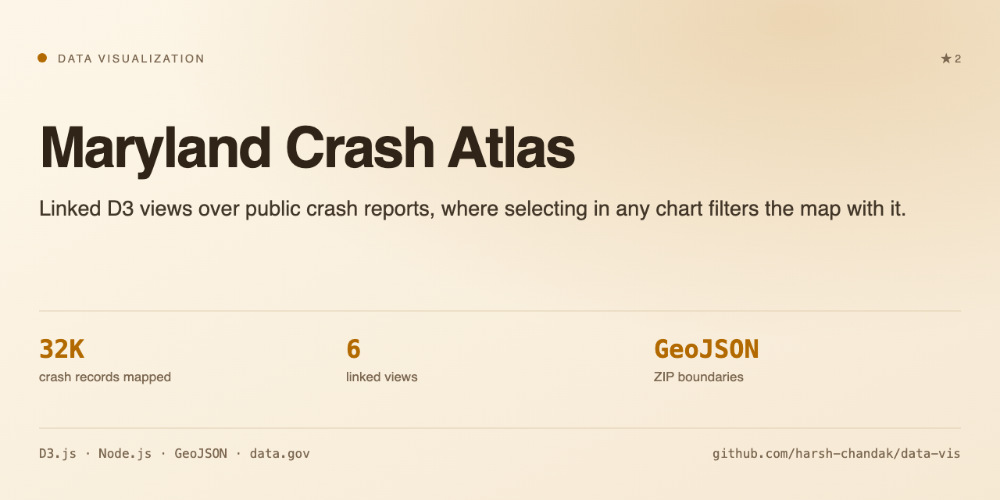
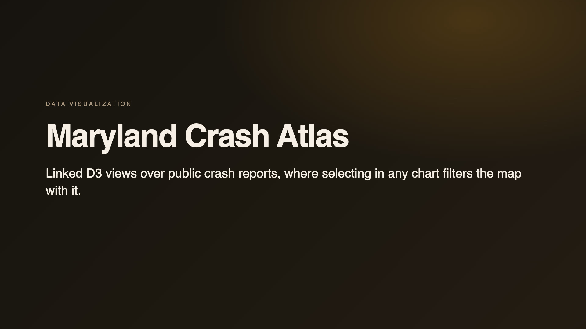

<picture>
  <source media="(prefers-color-scheme: dark)" srcset="assets/card-dark.png">
  <source media="(prefers-color-scheme: light)" srcset="assets/card-light.png">
  
</picture>

# Mapping Accident Trends and Patterns in Maryland

**[Live visualization](https://data-vis-0eqs.onrender.com/)**

[](https://github.com/harsh-chandak/data-vis/blob/main/assets/brag.mp4)

<sub>▶ Fifteen seconds on what the five views answer together. GitHub strips
`<video>` from READMEs, so the poster above links to the player.</sub>

Montgomery County publishes every reported crash: where it happened, the weather,
the light, the road surface, who was at fault and how badly people were hurt.
That is 32,429 records across 20 fields, which is far too many to read and far
too few dimensions to hold in your head at once.

This is that dataset as five views that are wired together. Brush a region of the
map and every chart redraws for those crashes only. Pick a severity band in the
mosaic and the map keeps just those points. The question the project is built
around is not "how many crashes" but "which conditions travel together" — and
that is a question you answer by moving between views, not by reading one.

## The views

| View | What it answers |
| --- | --- |
| **Geospatial map** | Where crashes cluster, with severity encoded on each point, over ZIP code boundaries from GeoJSON |
| **Pie chart matrix** | How crash outcomes differ between vehicle makes |
| **Mosaic chart** | Injury severity against light conditions, sized by how common each combination is |
| **Stacked bar matrix** | Weather and light conditions against crash counts, side by side |
| **Car in a clock** | Where the vehicle was struck, as the 12 positions on a clock face laid over a car, against how badly people were hurt |

Selections propagate across all five. The shared filter state lives in the page,
so no view owns the current selection and any of them can set it.

## Data

[Crash Reporting — Drivers Data](https://catalog.data.gov/dataset/crash-reporting-drivers-data),
Montgomery County, via data.gov.

The raw export is not usable as published, for two reasons. Records carry `NA`
in any of the fields the views depend on, and there is no ZIP code on a record at
all — only a latitude and longitude.

So the cleaning pass keeps only rows where all 17 fields it needs are present and
not `NA`, then gives each surviving crash a ZIP by testing its coordinate against
every polygon in `Zip_Code.geojson` with Turf's `booleanPointInPolygon`. That
join is what makes the map's boundaries usable as a filter rather than decoration.
The result is `final.csv`, which is what the page loads.

## Running it

```bash
npm install
npm run dev
```

The visualization is `index.html`, served statically. To regenerate `final.csv`
from a fresh download of the raw dataset, start the server and call the cleaning
endpoint once:

```bash
curl http://localhost:5000/data-cleaning
```

Port 5000 is hardcoded in `server.js`.

## Credits

Group project, Data Visualization, Fall 2024: Aman, Anirudh, Ashutosh, Harsh and
Soumya.
